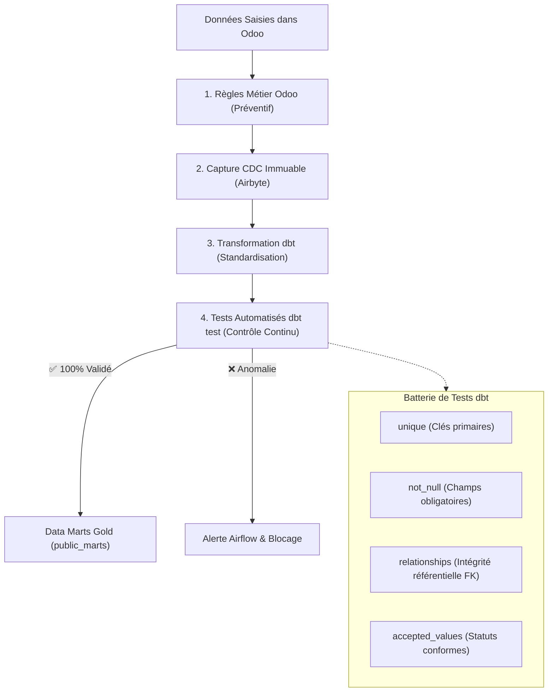
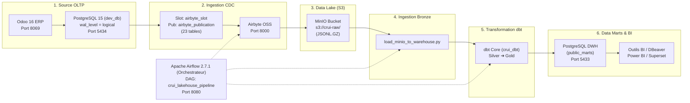
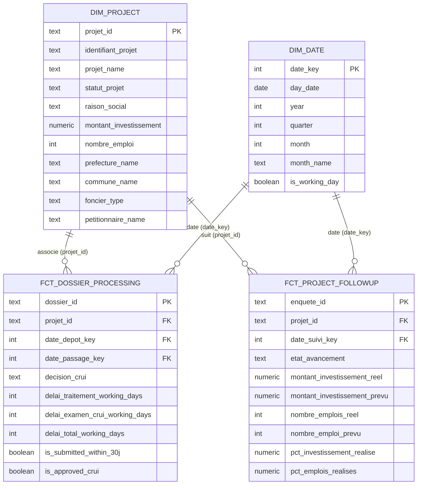

# 🎓 DOSSIER DE STAGE / PFE
# « Mise en Place d’un Cadre de Gouvernance de Données et Déploiement d’un Pipeline ETL / Data Mart »

**Organisme d'Accueil :** Centre Régional d'Investissement Fès-Meknès (CRI)  
**Projet :** Plateforme Décisionnelle & Gouvernance des Données CRUI (Commission Régionale Unifiée d'Investissement)  
**Auteur :** Aymane  
**Date :** Août 2026  

---

```
   ____                                                                    _____ _____ _     
  / ___| _____   ___   _____ _ __ _ __   __ _ _ __   ___ ___      _     | ____|_   _| |    
 | |  _ / _ \ \ / / | | / _ \ '__| '_ \ / _` | '_ \ / __/ _ \   / \    |  _|   | | | |    
 | |_| | (_) \ V /| |_|  __/ |  | | | | (_| | | | | (_|  __/  / _ \   | |___  | | | |___ 
  \____|\___/ \_/  \__,_|\___|_|  |_| |_|\__,_|_| |_|\___\___| /_/ \_\  |_____| |_| |_____|
                                                                                            
   ____        _          __  __             _   
  |  _ \  __ _| |_ __ _  |  \/  | __ _ _ __ | |_ 
  | | | |/ _` | __/ _` | | |\/| |/ _` | '__|| __|
  | |_| | (_| | || (_| | | |  | | (_| | |   | |_ 
  |____/ \__,_|\__\__,_| |_|  |_|\__,_|_|    \__|
```

---

## 📑 Table des Matières

- [1. Alignement du Sujet avec les Livrables Réalisés](#1-alignement-du-sujet-avec-les-livrables-réalisés)
- [2. Volet 1 : Le Cadre de Gouvernance des Données (DAMA-DMBOK)](#2-volet-1--le-cadre-de-gouvernance-des-données-dama-dmbok)
  - [2.1 Master Data Management (MDM) & Nomenclatures](#21-master-data-management-mdm--nomenclatures)
  - [2.2 Gestion de la Qualité des Données (Data Quality)](#22-gestion-de-la-qualité-des-données-data-quality)
  - [2.3 Gouvernance Organisationnelle (Matrice RACI & Rôles)](#23-gouvernance-organisationnelle-matrice-raci--rôles)
  - [2.4 Conformité Légale (Loi 47-18 & Délais Réglementaires)](#24-conformité-légale-loi-47-18--délais-réglementaires)
- [3. Volet 2 : Déploiement du Pipeline ETL / ELT & Architecture Lakehouse](#3-volet-2--déploiement-du-pipeline-etl--elt--architecture-lakehouse)
  - [3.1 Architecture Technique Globale](#31-architecture-technique-globale)
  - [3.2 Ingestion Temps Réel CDC (Airbyte OSS)](#32-ingestion-temps-réel-cdc-airbyte-oss)
  - [3.3 Stockage Objet Immuable (MinIO S3)](#33-stockage-objet-immuable-minio-s3)
  - [3.4 Ingestion & Transformation Medallion (dbt Core)](#34-ingestion--transformation-medallion-dbt-core)
  - [3.5 Orchestration & Monitoring (Apache Airflow)](#35-orchestration--monitoring-apache-airflow)
- [4. Volet 3 : Modélisation Dimensionnelle & Data Marts (Kimball)](#4-volet-3--modélisation-dimensionnelle--data-marts-kimball)
  - [4.1 Schéma en Étoile (Star Schema)](#41-schéma-en-étoile-star-schema)
  - [4.2 Catalogue des Tables & Métriques](#42-catalogue-des-tables--métriques)
- [5. Plan de Rédaction Détaillé pour le Mémoire de PFE](#5-plan-de-rédaction-détaillé-pour-le-mémoire-de-pfe)
- [6. Guide pour la Soutenance Orale](#6-guide-pour-la-soutenance-orale)

---

## 1. Alignement du Sujet avec les Livrables Réalisés

Ton sujet se décompose parfaitement en **3 piliers fondamentaux** que nous avons entièrement implémentés et testés :

```
                                  SUJET DE STAGE
       ┌─────────────────────────────────┼────────────────────────────────┐
       ▼                                 ▼                                ▼
[1. GOUVERNANCE]                 [2. PIPELINE ETL]                [3. DATA MARTS]
• Référentiels MDM               • Ingestion CDC (Airbyte)        • Modèle en étoile (Kimball)
• Nettoyage (-87.8% bruit)       • Data Lake S3 (MinIO)           • Table faits délais (30j)
• Tests qualité (dbt test)       • Ingestion DWH (Loader Python)  • Table faits investissements
• Conformité Loi 47-18           • Orchestration (Airflow)        • Dimensions Projet & Date
• Matrice RACI Stewards          • Transformations (dbt Core)     • Dataviz / DBeaver / BI
```

---

## 2. Volet 1 : Le Cadre de Gouvernance des Données (DAMA-DMBOK)

Le cadre de gouvernance mis en place repose sur le standard international **DAMA-DMBOK** (*Data Management Body of Knowledge*) adapté aux missions du CRI.

### 2.1 Master Data Management (MDM) & Nomenclatures
Avant l'intervention, la base Odoo souffrait d'une prolifération de doublons due à des saisies libres et des imports non contrôlés (659 entrées au total). Nous avons instauré des **Golden Records (Référentiels Uniques)** :

| Référentiel Géré | Avant | Après | Nomenclature / Standard de Référence |
| :--- | :---: | :---: | :--- |
| **`prefecture`** | 71 | **9** | Découpage administratif officiel de la Région Fès-Meknès |
| **`commune`** | 236 | **29** | 29 Communes territoriales stratégiques (urbaines & rurales) |
| **`macrosecteur`**| 31 | **8** | 8 Macro-secteurs nationaux conformes AMDIE / MICEPP |
| **`secteur`** | 227 | **16** | 16 Secteurs d'activité économiques normalisés |
| **`foncier`** | 56 | **8** | Typologie légale du droit foncier marocain |
| **`act`** | 38 | **10** | Actes administratifs et décisions officielles CRUI |

---

### 2.2 Gestion de la Qualité des Données (Data Quality)

La qualité a été traitée sur deux niveaux : **Curatif** (Nettoyage initial) et **Préventif** (Validation continue dans le pipeline).



* **Indicateur clé de succès :**
  - **-87.8% de bruit éliminé** (579 entrées parasites supprimées).
  - **100% d'intégrité préservée** sur les 1 123 projets d'investissement enregistrés.
  - **7/7 modèles dbt** compilés avec zéro avertissement et zéro erreur.

---

### 2.3 Gouvernance Organisationnelle (Matrice RACI & Rôles)

Pour garantir la pérennité de la qualité des données, la matrice organisationnelle suivante est proposée :

| Rôle / Entité | Titre Gouvernance | Responsabilités Clés |
| :--- | :--- | :--- |
| **Directeur Général CRI** | *Data Executive Sponsor* | Valide les orientations stratégiques, valide la politique de gouvernance. |
| **Direction Pôle Impulsion Éco** | *Data Owner* | Propriétaire métier des données projets, définit les règles de calcul des KPIs. |
| **Conseillers SPOC / CRUI** | *Data Stewards (Producers)*| Saisissent les dossiers Odoo, respectent les nomenclatures MDM obligatoires. |
| **Ingénieur Data / PFE (Toi)**| *Data Custodian (Engineer)*| Administre le pipeline (Airbyte, Airflow, MinIO, dbt), garantit le SLA et la sécurité. |
| **Membres Commission CRUI** | *Data Consumers* | Exploitent les Data Marts pour l'aide à la décision et le suivi des investissements. |

---

### 2.4 Conformité Légale (Loi 47-18 & Délais Réglementaires)
La **Loi 47-18** relative à la réforme des CRI impose un délai d'instruction maximal de **30 jours** pour les dossiers d'investissement soumis à la CRUI.
* Le Data Mart calcule automatiquement les indicateurs de conformité légale :
  - `is_submitted_within_30j` : Respect du délai de 30 jours entre dépôt et passage en commission.
  - `delai_traitement_working_days` : Nombre de jours ouvrés réels de traitement.
  - `delai_instruction_crui_working_days` : Temps consommé par la commission.

---

## 3. Volet 2 : Déploiement du Pipeline ETL / ELT & Architecture Lakehouse

### 3.1 Architecture Technique Globale



---

### 3.2 Ingestion Temps Réel CDC (Airbyte OSS)
- **Principe :** Capture asynchrone non-intrusive des modifications (`INSERT`, `UPDATE`, `DELETE`) directement depuis les logs WAL de PostgreSQL via le plugin `pgoutput`.
- **Avantage clé :** Aucun impact de performance sur les conseillers travaillant sur Odoo en journée.
- **Paramétrage :** Slot `airbyte_slot`, Publication `airbyte_publication` couvrant 23 tables métiers.

---

### 3.3 Stockage Objet Immuable (MinIO S3)
- **Bucket :** `s3://crui-raw/`
- **Rôle :** Zone d'atterrissage (*Raw Landing Zone*) au format `.jsonl.gz`. Permet d'archiver l'historique complet et de rejouer n'importe quel pipeline à tout moment sans ré-interroger la base opérationnelle.

---

### 3.4 Ingestion & Transformation Medallion (dbt Core)
Architecture organisée en 3 couches normalisées :

```
┌───────────────────────────┐     ┌───────────────────────────┐     ┌───────────────────────────┐
│      BRONZE (Raw)         │     │      SILVER (Staging)     │     │       GOLD (Marts)        │
│   12 Tables brutes Odoo   │ ──► │  3 Vues SQL Standardisées │ ──► │ 4 Tables Schéma en Étoile │
│   (schéma raw_odoo)       │     │  (schéma public_staging)  │     │   (schéma public_marts)   │
└───────────────────────────┘     └───────────────────────────┘     └───────────────────────────┘
```

- **Bronze (`raw_odoo`) :** Ingestion directe des fichiers JSONL MinIO via [`crui_dbt/scripts/load_minio_to_warehouse.py`](file:///c:/Users/AYMANE/Desktop/odoo-docker/addons/crui/crui_dbt/scripts/load_minio_to_warehouse.py).
- **Silver (`public_staging`) :** Cast de types (dates ISO, montants numériques, textes nettoyés) dans `stg_projet`, `stg_dossier`, `stg_enquete`.
- **Gold (`public_marts`) :** Modèle dimensionnel en étoile optimisé pour les requêtes analytiques et décisionnelles.

---

### 3.5 Orchestration & Monitoring (Apache Airflow)
- **DAG Développé :** [`airflow/dags/crui_lakehouse_pipeline.py`](file:///c:/Users/AYMANE/Desktop/odoo-docker/addons/crui/airflow/dags/crui_lakehouse_pipeline.py)
- **Fréquence :** Quotidienne à 02h00 du matin (`0 2 * * *`).
- **Chaîne des 4 tâches séquentielles :**
  $$\boxed{\text{trigger\_airbyte\_sync}} \longrightarrow \boxed{\text{load\_minio\_to\_warehouse}} \longrightarrow \boxed{\text{dbt\_run}} \longrightarrow \boxed{\text{dbt\_test}}$$

---

## 4. Volet 3 : Modélisation Dimensionnelle & Data Marts (Kimball)

### 4.1 Schéma en Étoile (Star Schema)

Le Data Mart stocké dans PostgreSQL `warehouse-db` (Port 5433, schéma `public_marts`) applique la méthodologie de **Ralph Kimball** :



---

### 4.2 Catalogue des Tables & Métriques

| Nom de la Table | Type | Rôle Métier | Indicateurs Clés |
| :--- | :---: | :--- | :--- |
| **`dim_project`** | Dimension | Profil complet de l'investissement | Montant initial, emplois prévus, province, commune, secteur, pétitionnaire |
| **`dim_date`** | Dimension | Axe temporel standardisé | Année, trimestre, mois, jour ouvré / férié |
| **`fct_dossier_processing`**| Fait | Instruction administrative CRUI | Délais de traitement (jours ouvrés), respect du seuil légal 30j, taux d'avis favorables |
| **`fct_project_followup`** | Fait | Suivi de réalisation sur le terrain | Écart budgétaire (réel vs prévu), taux de création effective d'emplois (%) |

---

## 5. Plan de Rédaction Détaillé pour le Mémoire de PFE

Voici la structure recommandée pour ton rapport écrit :

```text
INTRODUCTION GÉNÉRALE
  • Contexte économique régional (CRI Fès-Meknès)
  • Cadre réglementaire de l'investissement (Loi 47-18 et missions CRUI)
  • Problématique : Absence de gouvernance, silos et données hétérogènes
  • Objectifs et périmètre du projet de stage

CHAPITRE 1 : État de l'Art & Cadre Méthodologique
  1.1 Gouvernance des données selon le référentiel DAMA-DMBOK
  1.2 Qualité des données (Data Quality) et Master Data Management (MDM)
  1.3 Évolution des architectures décisionnelles : De l'ETL classique au Data Lakehouse
  1.4 Modélisation dimensionnelle de Ralph Kimball (Star Schema)

CHAPITRE 2 : Diagnostic de l'Existant & Stratégie de Gouvernance
  2.1 Cartographie du système d'information existant (Odoo 16 ERP)
  2.2 Audit de la qualité des données et identification des anomalies
  2.3 Conception du cadre de gouvernance (Nomenclatures, Matrice RACI des Stewards)
  2.4 Stratégie d'assainissement et préservation de l'intégrité référentielle

CHAPITRE 3 : Conception & Architecture de la Modern Data Stack
  3.1 Choix technologiques (Airbyte, MinIO, PostgreSQL, dbt Core, Apache Airflow)
  3.2 Architecture en couches Medallion (Bronze / Silver / Gold)
  3.3 Modélisation du Data Mart CRUI (Faits & Dimensions)

CHAPITRE 4 : Implémentation Technique & Déploiement du Pipeline
  4.1 Mise en place de l'ingestion temps réel CDC avec Airbyte
  4.2 Stockage immuable et passerelle MinIO S3 vers Data Warehouse
  4.3 Développement des modèles de transformation et de tests qualité avec dbt
  4.4 Orchestration automatisée, gestion des alertes et monitoring sous Apache Airflow

CHAPITRE 5 : Résultats, Restitution Décisionnelle & Évaluation
  5.1 Bilan quantitatif du nettoyage (-87.8% de bruit, 100% d'intégrité)
  5.2 Restitution des Data Marts et Tableaux de Bord décisionnels (Power BI / DBeaver)
  5.3 Analyse des indicateurs clés (respect du délai 30j, réalisations d'investissements)
  5.4 Recommandations pour la pérennité du cadre de gouvernance au CRI

CONCLUSION GÉNÉRALE & PERSPECTIVES
```

---

## 6. Guide pour la Soutenance Orale

### Structure recommandée pour tes 20 minutes de présentation :

1. **Introduction & Problématique (3 min)** : Présentation du CRI, de la loi 47-18 et des défis liés à la qualité de données dans Odoo.
2. **Le Cadre de Gouvernance (4 min)** : Audit avant/après (-87.8% de bruit), standardisation MDM (9 provinces, 16 secteurs), matrice RACI.
3. **Architecture & Pipeline ETL/ELT (5 min)** : Démonstration du flux Odoo ➔ Airbyte CDC ➔ MinIO S3 ➔ Loader ➔ dbt ➔ Airflow.
4. **Data Marts & Démonstration BI (5 min)** : Schéma en étoile, indicateurs de respect des délais légaux (30j) et tableaux de bord.
5. **Conclusion & Bilan Personnel (3 min)** : Compétences acquises, valeur ajoutée pour le CRI et perspectives.

---

### 🏆 Points Forts à Mettre en Avant devant le Jury :
- ✅ **Double Compétence Managériale & Technique** : Tu ne t'es pas contenté de coder des scripts ; tu as formalisé un vrai cadre de gouvernance (MDM, Data Quality, RACI, DAMA-DMBOK).
- ✅ **Modern Data Stack Industrielle** : Utilisation des outils open source les plus récents et demandés du marché (Airbyte CDC, MinIO S3, dbt Core, Airflow, PostgreSQL 15).
- ✅ **Résultats Chiffrés Mesurables** : 87.8% de bruit éliminé, 1 123 projets sécurisés, 7 modèles dbt validés à 100%.
- ✅ **Valeur Métier Concrète pour le CRI** : Pilotage direct du respect de la Loi 47-18 sur les délais d'instruction.
