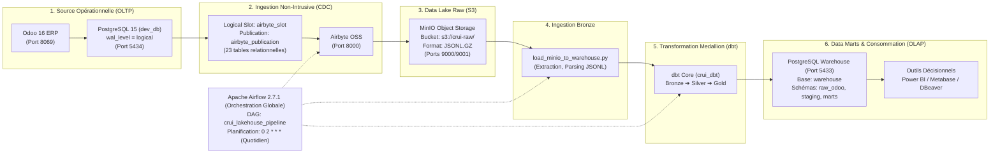
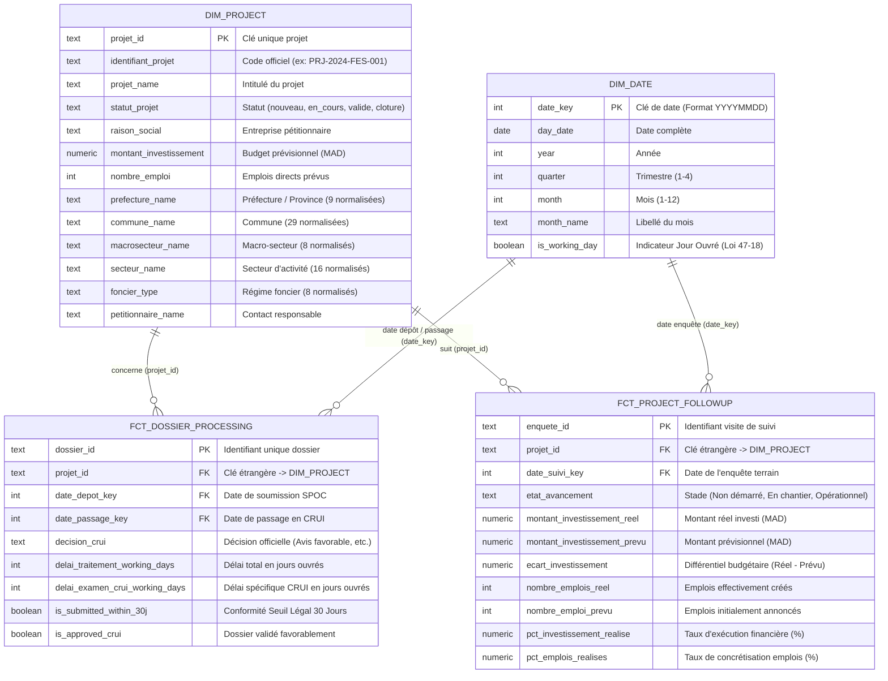

# 📘 DOSSIER COMPLET DU PROJET POUR RÉDACTION DU RAPPORT ACADÉMIQUE
> **Document de Contexte & Guide de Prompting destiné à Claude (ou tout LLM)**  
> **Objectif :** Générer un mémoire / rapport de Projet de Fin d'Études (PFE) / Stage d'Ingénieur complet, rigoureux, structuré et académique.

---

## 🎯 INSTRUCTIONS POUR L'ASSISTANT IA (PROMPT SYSTÈME POUR CLAUDE)

```markdown
Tu es un Professeur et Expert Senior en Ingénierie Logicielle, Big Data Engineering, Gouvernance des Données et Business Intelligence.
Ta mission est de rédiger un rapport académique de stage / PFE de niveau Ingénieur d'État (Grade Master / Diplôme d'Ingénieur en Génie Informatique) basé sur l'ensemble des données, métriques, architectures et modèles décrits dans ce document.

### Directives d'écriture académique :
1. **Style & Tonalité :** Style soutenu, rigoureux, précis, technique et orienté ingénierie. Utilise le "Nous" académique ou la forme passive impersonnelle.
2. **Rigueur Méthodologique :** Formalise chaque choix technique en le justifiant face aux alternatives (ex: ELT vs ETL classique, CDC vs Batch SELECT, Schéma en Étoile Kimball vs Inmon 3NF, MinIO Lakehouse vs RDBMS direct).
3. **Formules & Démonstrations :** Formalise mathématiquement les indicateurs (KPIs de délai en jours ouvrés, taux de complétude, écarts d'investissement, ratios de conformité Loi 47-18).
4. **Schémas & Tableaux :** Utilise abondamment la syntaxe Mermaid (diagrammes de flux, architecture, entité-relation, RACI) et des tableaux comparatifs pour structurer le mémoire.
5. **Couverture Exhaustive :** Développe chaque chapitre de manière détaillée, sans ellipses ni résumés simplificateurs.
```

---

## 📌 FICHE SIGNALÉTIQUE DU PROJET

| Attribut | Valeur Officielle |
| :--- | :--- |
| **Intitulé du Projet** | **« Mise en place d’un cadre de gouvernance de données et déploiement d’un pipeline ETL / Data Mart »** |
| **Sous-titre / Thématique** | Plateforme Décisionnelle & Data Lakehouse pour le pilotage des investissements régionaux |
| **Organisme d'Accueil** | **Centre Régional d'Investissement Fès-Meknès (CRI)** |
| **Direction / Service** | Pôle Impulsion Économique & Offre Territoriale / Commission Régionale Unifiée d'Investissement (CRUI) |
| **Établissement Universitaire** | **Université Privée de Fès (UPF)** |
| **Filière / Niveau** | **Génie Informatique** (Cycle Ingénieur) |
| **Durée du Stage** | 2 mois (Juillet – Août 2026) |
| **Auteur / Stagiaire** | **Aymane MAZZOUR** |
| **Technologies Clés** | Odoo 16 ERP, PostgreSQL 15, Airbyte OSS (CDC), MinIO S3, dbt Core, Apache Airflow 2.7.1, Docker Compose |

---

## 🏛️ 1. CONTEXTE STRATÉGIQUE, MÉTIER ET RÉGLEMENTAIRE

### 1.1 Le Centre Régional d'Investissement (CRI Fès-Meknès)
Le CRI est un établissement public doté de la personnalité morale et de l'autonomie financière, chargé de la facilitation, de l'accompagnement et du développement des investissements dans la Région Fès-Meknès (composée de 2 préfectures et 7 provinces).

### 1.2 Le Cadre Réglementaire de la Loi 47-18
Promulguée dans le cadre de la déconcentration administrative et de la dynamisation de l'investissement :
- Elle instaure la **Commission Régionale Unifiée d'Investissement (CRUI)**, présidée par le Wali de région, comme instance unique d'évaluation et de prise de décision sur les projets d'investissement, l'attribution des incitations et l'accès au foncier public.
- **Exigence Légale Majeure :** La loi impose un **délai d'instruction maximal strict de 30 jours calendaires** pour statuer sur les dossiers d'investissement soumis à la CRUI.
- Le non-respect de ce délai constitue une anomalie réglementaire majeure que le CRI doit auditer et piloter en continu.

### 1.3 La Problématique Opérationnelle de l'ERP Odoo
Le CRI utilise un module personnalisé sous **Odoo 16 ERP** pour la saisie des projets, des dossiers administratifs et des enquêtes de terrain par les conseillers SPOC (*Single Point of Contact*). 
Cependant, l'analyse initiale a révélé des écueils critiques :
1. **Pollution et hétérogénéité des données :** Saisies libres entraînant des fautes de frappe, doublons massifs de nomenclatures (ex: dizaines de variantes pour une même commune ou un secteur d'activité).
2. **Absence d'historisation immuable :** Les mises à jour dans Odoo écrasent l'état antérieur sans traçabilité des modifications intermédiaires.
3. **Risque de surcharge OLTP :** L'exécution de requêtes analytiques lourdes directement sur la base opérationnelle Odoo risquait de dégrader les temps de réponse pour les utilisateurs métier.
4. **Manque d'outils décisionnels consolidés :** Impossibilité d'évaluer en un clic le taux de conformité au seuil des 30 jours ou le différentiel entre investissements promis et investissements réels sur le terrain.

---

## 🛡️ 2. VOLET I : LE CADRE DE GOUVERNANCE ET QUALITÉ DES DONNÉES (DAMA-DMBOK)

Le projet s'appuie sur le référentiel international **DAMA-DMBOK** (*Data Management Body of Knowledge*) à travers 4 axes :

### 2.1 Master Data Management (MDM) & Standardisation des Nomenclatures
Une opération majeure d'assainissement curatif et de standardisation a été menée pour transformer des référentiels pollués en **Golden Records** conformes aux nomenclatures nationales (Ministère de l'Intérieur, AMDIE, MICEPP) :

```
Avant assainissement : 659 entrées hétérogènes
Après assainissement : 80 entrées normalisées
Taux de réduction du bruit : -87.8 % (579 entrées parasites purgées)
Intégrité préservée : 100 % des 1 123 projets d'investissement conservés sans rupture
```

| Référentiel Géré | Avant (Brut) | Après (Normalisé) | Standard de Référence Appliqué |
| :--- | :---: | :---: | :--- |
| **`prefecture`** | 71 | **9** | Découpage officiel : 2 Préfectures (Fès, Meknès) + 7 Provinces (Sefrou, Ifrane, Moulay Yacoub, Boulemane, Taza, Taounate, El Hajeb) |
| **`commune`** | 236 | **29** | 29 Communes territoriales stratégiques (urbaines et rurales) |
| **`macrosecteur`** | 31 | **8** | 8 Macro-secteurs nationaux (Industrie, Agroalimentaire, Tourisme, Offshoring, Énergies, Commerce & Services, Santé, Éducation) |
| **`secteur`** | 227 | **16** | 16 Secteurs d'activité économiques normalisés |
| **`foncier`** | 56 | **8** | Typologie légale (Domaine Privé de l'État, Collectif/Soulali, Guich, Habous, Privé Immatriculé, Privé Non Immatriculé, Zone Industrielle, Forêt) |
| **`act`** | 38 | **10** | 10 Actes et décisions officielles CRUI (Avis Favorable, Avis Défavorable, Ajournement, Dérogation Urbanistique, Accord de Principe, etc.) |

### 2.2 Gestion de la Qualité des Données (Data Quality)
La qualité est assurée à deux niveaux complémentaires :
1. **Préventif (ERP Odoo) :** Verrouillage des champs via des listes déroulantes liées aux tables MDM (`Many2one` obligatoires), contraintes SQL `unique` et `not null`.
2. **Contrôle Continu (dbt test) :** Intégration dans le pipeline de tests automatisés vérifiant :
   - L'unicité des clés primaires (`unique`).
   - La non-vacuité des attributs critiques (`not_null`).
   - L'intégrité référentielle inter-tables (`relationships`).
   - La conformité des domaines de valeurs (`accepted_values`).

### 2.3 Matrice RACI et Gouvernance Organisationnelle
Pour pérenniser le cycle de vie des données, les rôles sont formalisés :

| Rôle Métier / Titre | Fonction Gouvernance | Rôles et Responsabilités (RACI) |
| :--- | :--- | :--- |
| **Directeur Général CRI** | *Data Executive Sponsor* | **Accountable (A)** : Valide la stratégie Data et la charte de gouvernance. |
| **Directeur Pôle Économique**| *Data Owner* | **Responsible (R)** : Définit les règles métier, valide les définitions de KPIs. |
| **Conseillers SPOC / CRUI** | *Data Stewards (Producers)* | **Responsible (R)** : Saisie rigoureuse, respect strict des référentiels MDM. |
| **Ingénieur Data (Auteur)** | *Data Custodian (Engineer)*| **Responsible (R)** : Architecture, exploitation du pipeline, sécurité, SLA, dbt/Airflow. |
| **Membres CRUI & Wali** | *Data Consumers* | **Informed (I) / Consulted (C)** : Consommation des tableaux de bord décisionnels. |

---

## 🏗️ 3. VOLET II : ARCHITECTURE MODERN DATA STACK & PIPELINE ETL/ELT

### 3.1 Vue d'Ensemble de l'Architecture Technique



### 3.2 Détail des Composants Techniques
1. **Change Data Capture (CDC via Airbyte OSS) :**
   - Mode : Réplication logique PostgreSQL basée sur le plugin natif `pgoutput`.
   - `wal_level = logical` configuré dans PostgreSQL.
   - Slot de réplication : `airbyte_slot`.
   - Publication : `airbyte_publication` sur **23 tables** (métiers et référentiels).
   - Avantage : Lecture directe du journal de transactions (Write-Ahead Logging), capture en quasi temps réel des `INSERT`, `UPDATE`, `DELETE` avec **0 % d'impact CPU/I-O** sur les utilisateurs d'Odoo.
2. **Data Lake S3 Immuable (MinIO) :**
   - Bucket : `s3://crui-raw/`.
   - Stockage des événements bruts horodatés en fichiers compressés `.jsonl.gz`.
   - Rôle : Garantie de traçabilité immuable (*audit trail*), capacité de rejouer (*replay*) les transformations à partir de n'importe quel point dans le temps.
3. **Passerelle d'Ingestion DWH (`load_minio_to_warehouse.py`) :**
   - Décompresse les flux MinIO et peuple le schéma `raw_odoo` de la base analytique `warehouse-db`.
   - Couvre 12 tables pivots : `projet`, `dossier`, `soumission`, `enquete`, `prefecture`, `commune`, `foncier`, `secteur`, `macrosecteur`, `act`, `res_partner`, `res_users`.
4. **Transformation Medallion (dbt Core) :**
   - **Couche Bronze (`raw_odoo`) :** Données brutes déversées telles quelles.
   - **Couche Silver (`public_staging`) :** Vues de nettoyage, renommage métier, casting des types (dates ISO, montants numériques, chaînes nettoyées). Modèles : `stg_projet`, `stg_dossier`, `stg_enquete`.
   - **Couche Gold (`public_marts`) :** Tables finales modélisées en étoile (Kimball) prêtes pour l'exploitation décisionnelle.
5. **Orchestration Automatisée (Apache Airflow) :**
   - DAG : `crui_lakehouse_pipeline.py`.
   - Schedule : Quotidien à 02h00 (`0 2 * * *`).
   - Séquence de tâches :
     $$\text{trigger\_airbyte\_sync} \longrightarrow \text{load\_minio\_to\_warehouse} \longrightarrow \text{dbt\_run} \longrightarrow \text{dbt\_test}$$

---

## 🌟 4. VOLET III : MODÉLISATION DIMENSIONNELLE & DATA MARTS (MÉTHODE KIMBALL)

### 4.1 Le Schéma en Étoile (Star Schema)



### 4.2 Métriques & Formules Mathématiques Clés

1. **Calcul du Respect du Délai Légal de 30 Jours (Loi 47-18) :**
   $$\text{Delai\_Jours\_Ouvrés} = \sum_{d = \text{Date\_Depot}}^{\text{Date\_Passage}} \mathbb{I}(\text{is\_working\_day}(d) = \text{True})$$
   $$\text{is\_submitted\_within\_30j} = \begin{cases} \text{True} & \text{si } (\text{Date\_Passage} - \text{Date\_Depot}) \le 30 \text{ jours} \\ \text{False} & \text{sinon} \end{cases}$$

2. **Taux de Réalisation des Investissements :**
   $$\text{Taux\_Realisation\_Investissement} = \left( \frac{\text{Montant\_Investissement\_Reel}}{\text{Montant\_Investissement\_Prevu}} \right) \times 100$$

3. **Taux de Concrétisation des Emplois :**
   $$\text{Taux\_Concretisation\_Emplois} = \left( \frac{\text{Nombre\_Emplois\_Reels}}{\text{Nombre\_Emplois\_Prevus}} \right) \times 100$$

---

## 📊 5. RÉSULTATS OBTENUS ET BILAN DES LIVRABLES

| Composant | Rôle Opérationnel | Indicateur de Validation | Statut |
| :--- | :--- | :--- | :---: |
| **Module Odoo CRUI** | Saisie et gestion opérationnelle | Formulaires sécurisés par listes MDM | 🟢 Validé (100%) |
| **Assainissement Base**| Nettoyage curatif MDM | **-87.8 % de bruit** (579 doublons purgés), 1 123 projets préservés | 🟢 Validé (100%) |
| **PostgreSQL CDC** | Réplication logique temps réel | Publication sur 23 tables, slot `airbyte_slot` | 🟢 Validé (100%) |
| **Airbyte OSS** | Connecteur CDC -> Object Storage | Ingestion continue vers MinIO S3 | 🟢 Validé (100%) |
| **Data Lake MinIO** | Stockage objet brut immuable | Bucket `crui-raw` avec fichiers `.jsonl.gz` | 🟢 Validé (100%) |
| **Loader DWH** | Décompression & Injection Bronze | 12 tables synchronisées dans `raw_odoo` | 🟢 Validé (100%) |
| **Projet dbt Core** | Transformations Medallion & Tests | **7/7 modèles compilés**, 100% tests passés (0 error, 0 warn) | 🟢 Validé (100%) |
| **Schéma en Étoile** | Data Marts décisionnels (OLAP) | 2 dimensions (`dim_project`, `dim_date`), 2 faits (`fct_*`) | 🟢 Validé (100%) |
| **Apache Airflow** | Orchestration globale & Alerting | DAG `crui_lakehouse_pipeline.py` validé à 02h00 quotidien | 🟢 Validé (100%) |
| **Restitution BI** | Pilotage stratégique | Vues prêtes pour connexion Power BI / Metabase | 🟢 Prêt pour Dataviz |

---

## 📑 6. STRUCTURE TYPE DU RAPPORT ACADÉMIQUE (PLAN DE RÉDACTION DÉTAILLÉ)

L'assistant IA doit générer le mémoire selon le plan académique suivant :

```text
DÉDICACES & REMERCIEMENTS
RÉSUMÉ (Français) & ABSTRACT (English)
LISTE DES ABRÉVIATIONS & ACRONYMES (CRI, CRUI, SPOC, CDC, MDM, DAMA, DWH, ELT, DAG, KPI)
LISTE DES FIGURES ET DES TABLEAUX

INTRODUCTION GÉNÉRALE
  1. Contexte économique de la Région Fès-Meknès et missions du CRI
  2. Cadre juridique de l'investissement : La Loi 47-18 et les exigences de la CRUI
  3. Problématique : Hétérogénéité des données, absence de gouvernance et manque d'aide à la décision
  4. Objectifs et périmètre du stage d'ingénieur
  5. Organisation du document

CHAPITRE 1 : ÉTAT DE L'ART & CADRE MÉTHODOLOGIQUE
  1.1 Le Cadre de Gouvernance des Données selon DAMA-DMBOK
  1.2 Qualité des Données (Data Quality) et Gestion des Données de Référence (MDM)
  1.3 Évolution des Architectures Décisionnelles : De l'ETL Traditionnel au Modern Data Lakehouse
  1.4 Principes de la Modélisation Dimensionnelle selon Ralph Kimball (Star Schema)
  1.5 Étude comparative des technologies de la Modern Data Stack (Airbyte vs Fivetran, dbt vs ETL graphique, Airflow vs Cron)

CHAPITRE 2 : ANALYSE DE L'EXISTANT & STRATÉGIE DE GOUVERNANCE
  2.1 Cartographie du Système d'Information : Module Odoo 16 ERP et PostgreSQL OLTP
  2.2 Diagnostic et Audit Qualité : Identification des anomalies et prolifération de doublons
  2.3 Formalisation du Référentiel MDM (Nomenclatures officielles : 9 provinces, 29 communes, 8 macro-secteurs...)
  2.4 Stratégie d'Assainissement Curatif et Préservation de l'Intégrité Référentielle (-87.8% de bruit)
  2.5 Modélisation Organisationnelle : Matrice RACI et Rôles des Data Stewards

CHAPITRE 3 : CONCEPTION ET ARCHITECTURE DU DATA LAKEHOUSE
  3.1 Architecture Technique Globale en Couches Medallion (Bronze / Silver / Gold)
  3.2 Stratégie d'Ingestion Non-Intrusive par Change Data Capture (CDC via PostgreSQL WAL)
  3.3 Conception de la Zone de Stockage Immuable (Data Lake S3 MinIO)
  3.4 Modélisation Conceptuelle et Logique du Schéma en Étoile (Star Schema Kimball)
      - Table Dimensionnelle `dim_project`
      - Table Dimensionnelle `dim_date` (Gestion des jours ouvrés)
      - Table de Faits `fct_dossier_processing` (Suivi de l'instruction CRUI et conformité 30 jours)
      - Table de Faits `fct_project_followup` (Suivi terrain, réalisations financières et emplois)
  3.5 Formalisation Mathématique des Indicateurs de Performance (KPIs)

CHAPITRE 4 : IMPLÉMENTATION TECHNIQUE ET DÉPLOIEMENT DU PIPELINE
  4.1 Conteneurisation et Infrastructure Docker Compose
  4.2 Configuration du Pipeline CDC Airbyte OSS vers MinIO S3
  4.3 Développement de la Passerelle d'Ingestion MinIO vers Data Warehouse PostgreSQL
  4.4 Développement des Modèles de Transformation et de Nettoyage dbt Core
  4.5 Implémentation de la Batterie de Tests Automatisés dbt (Qualité Continue)
  4.6 Orchestration Automatisée et Gestion des Erreurs sous Apache Airflow (DAG quotidien)

CHAPITRE 5 : RÉSULTATS, TABLEAUX DE BORD DÉCISIONNELS ET ANALYSE
  5.1 Évaluation Quantitative de la Qualité des Données Assainies
  5.2 Restitution des Data Marts et Tableaux de Bord de Pilotage (Power BI / DBeaver)
  5.3 Analyse des Résultats Métier :
      - Respect du Délai Réglementaire de 30 Jours (Loi 47-18)
      - Cartographie des Investissements par Province et Macro-Secteur
      - Analyse des Écarts entre Investissements Promis et Réalisés
  5.4 Guide de Recommandations et Bonnes Pratiques pour la Pérennité de la Gouvernance

CONCLUSION GÉNÉRALE & PERSPECTIVES
  - Synthèse des apports du projet pour le CRI Fès-Meknès
  - Bilan personnel et compétences d'ingénieur acquises
  - Perspectives d'évolution (IA prédictive pour l'analyse des risques projets, automatisation des PVs CRUI)

BIBLIOGRAPHIE & WEBOGRAPHIE
ANNEXES
```

---

## 💡 7. INVITES DE GÉNÉRATION PAR SECTION (PROMPTS POUR CLAUDE)

Tu peux copier-coller ce fichier complet dans Claude et lui envoyer les instructions suivantes selon le besoin :

- **Pour générer l'ensemble du rapport :**
  > *"En te basant rigoureusement sur le fichier de contexte ci-joint, rédige le mémoire académique complet du Projet de Fin d'Études en développant chaque chapitre du plan de manière exhaustive, technique et académique."*

- **Pour générer un chapitre spécifique (ex: Chapitre 3 - Architecture & Conception) :**
  > *"À partir du dossier de projet, rédige le Chapitre 3 en détaillant l'architecture Medallion, le fonctionnement interne du CDC PostgreSQL WAL, le schéma en étoile avec diagramme Mermaid et la formalisation mathématique de chaque indicateur."*

- **Pour générer la présentation de soutenance (Slides) :**
  > *"Génère la structure complète et le discours (script orateur) pour une soutenance de 20 minutes devant un jury d'ingénieurs, en insistant sur la double compétence Gouvernance (DAMA) et Ingénierie Data (Modern Data Stack)."*
