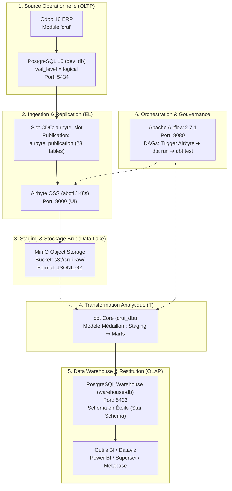

# 📑 RAPPORT D'ÉTAT D'AVANCEMENT TECHNIQUE & OPÉRATIONNEL
## Projet : Plateforme Décisionnelle & Pipeline Data CRUI
**Digitalisation et Pilotage des Investissements – CRI Fès-Meknès**

---

| Métadonnée | Valeur |
| :--- | :--- |
| **Projet** | Pipeline ETL/ELT & Data Warehouse CRUI |
| **Périmètre** | Odoo ERP ➔ Airbyte CDC ➔ MinIO Data Lake ➔ dbt Core ➔ PostgreSQL Warehouse ➔ Airflow |
| **Date du Rapport** | 25 Août 2026 |
| **Version du Document** | v1.2 (Rapport d'étape consolidé) |
| **Statut Global** | 🟢 **75% – Phase d'ingestion validée / Phase de modélisation en cours** |

---

## 1. Synthèse Exécutive (Executive Summary)

Le projet **CRUI Data Platform** a pour vocation de centraliser, fiabiliser et valoriser l'ensemble des données relatives aux projets d'investissement instruits par la Commission Régionale Unifiée d'Investissement (CRUI) de la région Fès-Meknès.

À ce stade du projet :
- Le socle applicatif **Odoo ERP** est pleinement opérationnel avec l'intégration réussie d'un jeu de données de référence et de tests représentatifs.
- La chaîne d'extraction **Change Data Capture (CDC)** via les logs de réplication PostgreSQL est active et connectée à **Airbyte OSS**.
- L'ingestion des données brutes (*Raw Ingestion*) a été validée avec succès vers le Data Lake / Destination.
- La structure de transformation analytique **dbt Core** (modèle dimensionnel en étoile) est rédigée et prête pour l'exécution.
- Le pipeline nécessite désormais la mise en place de l'automatisation via **Apache Airflow** et la connexion des tableaux de bord décisionnels (BI).

---

## 2. Architecture Globale du Système

Le flux de données suit les principes de la **Modern Data Stack** articulée autour du pattern **ELT** (Extract, Load, Transform) :



---

## 3. Matrice d'Avancement par Composant

| # | Brique Technologique | Responsabilité | Statut | Taux | Livrables & Observations |
|---|:---|:---|:---:|:---:|:---|
| **1** | **Odoo CRUI & ERP** | Saisie & Gestion Métier | 🟢 Terminé | **100%** | Module installé, formulaires opérationnels, chargement des données de référence. |
| **2** | **CDC PostgreSQL** | Capture des flux sans impact | 🟢 Terminé | **100%** | `wal_level=logical`, slot `airbyte_slot`, publication `airbyte_publication` (23 tables). |
| **3** | **Airbyte Ingestion** | Extraction & Chargement EL | 🟢 Terminé | **100%** | Connecteur source PostgreSQL CDC configuré, synchronisation réussie vers la destination. |
| **4** | **Data Lake MinIO** | Stockage immuable (Raw) | 🟢 Terminé | **100%** | Bucket `crui-raw` initialisé, fichiers JSONL partitionnés reçus. |
| **5** | **dbt Core (Modélisation)** | Transformation & Métier | 🟡 En cours | **85%** | Fichiers SQL (`stg_*`, `dim_*`, `fct_*`) développés. En attente de l'exécution (`dbt run`). |
| **6** | **PostgreSQL Warehouse** | Stockage analytique (Marts) | 🟡 Prêt | **60%** | Conteneur `warehouse-db` actif sur le port 5433, prêt à accueillir les tables de faits. |
| **7** | **Apache Airflow** | Orchestration & Alerting | 🔴 À Démarrer | **15%** | Conteneurs actifs (webserver/scheduler), code du DAG d'automatisation à créer dans `dags/`. |
| **8** | **Restitution / BI** | Tableaux de bord & KPIs | 🔴 À Démarrer | **0%** | Conception des dashboards post-création des tables de Marts. |

---

## 4. Détail Technique des Réalisations

### 4.1. Socle Opérationnel Odoo & Jeu de Données de Référence
- **Environnement :** Odoo exécuté sous conteneur Docker relié à `dev_db` (PostgreSQL 15).
- **Fichier de Données Démo :** [`data/demo_projet_data.xml`](./data/demo_projet_data.xml) activé via [`__manifest__.py`](./__manifest__.py).
- **Entités Métier créées :**
  - **4 Projets complets** illustrant les différents cycles de vie CRUI :
    1. `PRJ-2024-FES-001` : **Atlas Packaging SARL** (*Statut : Traitement CRUI* – Investissement : 55 MDH – 135 emplois – Parc Industriel Sidi Brahim, Fès).
    2. `PRJ-2024-IFR-004` : **Société Cèdre Resort SA** (*Statut : Traitement SPOC* – Investissement : 82 MDH – 90 emplois – Ifrane).
    3. `PRJ-2024-SEF-012` : **Saïss Bio Huiles SARL AU** (*Statut : Nouveau* – Investissement : 28.5 MDH – 45 emplois – Parc Aïn Cheggag, Sefrou).
    4. `PRJ-2023-FES-078` : **Tech Park Fès SA** (*Statut : Clôturé / Opérationnel* – Investissement : 32 MDH – 350 emplois – Fès Shore).
  - **Tables de référence :** 4 Préfectures/Provinces, 5 Communes, 4 Macro-secteurs, 4 Secteurs industriels, 4 Régimes fonciers, Actes administratifs, Dossiers d'instruction et Enquêtes de suivi.

---

### 4.2. Capture des Changements en Temps Réel (CDC)
- **Principe :** Lecture directe des Write-Ahead Logs (WAL) PostgreSQL sans surcharger l'ERP ni exécuter de requêtes `SELECT` périodiques lourdes.
- **Paramétrage Serveur :** `wal_level = logical`, `max_replication_slots = 4`, `max_wal_senders = 4`.
- **Script Exécuté :** [`airbyte/scripts/setup_cdc.sql`](./airbyte/scripts/setup_cdc.sql)
  - **Slot :** `airbyte_slot` (plugin standard `pgoutput`).
  - **Publication :** `airbyte_publication` couvrant **23 tables relationnelles** (tables de faits, dimensions Odoo et tables de liaison Many-to-Many).
- **Vérification :** Le connecteur source Airbyte (`odoo_postgres_cdc`) lit les flux incrémentaux avec succès.

---

### 4.3. Architecture de Transformation dbt (Modèle Médaillon)

Le projet [`crui_dbt`](./crui_dbt/) structure la donnée selon le standard **Bronze ➔ Silver ➔ Gold** :

```
┌─────────────────────────┐      ┌─────────────────────────┐      ┌─────────────────────────┐
│     BRONZE (Raw)        │      │     SILVER (Staging)    │      │      GOLD (Marts)       │
│  Tables brutes Odoo     │ ───► │  Nettoyage & Typage     │ ───► │  Modèle en Étoile OLAP  │
│  (odoo_raw.*)           │      │  (stg_projet, dossier)  │      │  (dim_*, fct_*)         │
└─────────────────────────┘      └─────────────────────────┘      └─────────────────────────┘
```

#### A. Couche Staging (Silver) – [`crui_dbt/models/staging/`](./crui_dbt/models/staging/)
- Standardisation des noms de colonnes et uniformisation de la nomenclature.
- Typage strict des montants financiers (`numeric`) et des dates (`timestamp`).
- Gestion des valeurs manquantes et des clés de jointure.
  - Ex : [`stg_projet.sql`](./crui_dbt/models/staging/stg_projet.sql), [`stg_dossier.sql`](./crui_dbt/models/staging/stg_dossier.sql), [`stg_enquete.sql`](./crui_dbt/models/staging/stg_enquete.sql).

#### B. Couche Marts (Gold) – [`crui_dbt/models/marts/`](./crui_dbt/models/marts/)
- **Tables de Dimensions :**
  - [`dim_project.sql`](./crui_dbt/models/marts/dimensions/dim_project.sql) : Dénormalisation complète des attributs du projet (nom du pétitionnaire, libellé de la commune, préfecture, nature du foncier, statut juridique).
  - [`dim_date.sql`](./crui_dbt/models/marts/dimensions/dim_date.sql) : Dimension temporelle pour les analyses par année, trimestre, mois et jour ouvré.
- **Tables de Faits :**
  - [`fct_dossier_processing.sql`](./crui_dbt/models/marts/facts/fct_dossier_processing.sql) : Métriques de performance des dossiers (délais de réaction SPOC, délais d'instruction CRUI, respect des échéances légales).
  - [`fct_project_followup.sql`](./crui_dbt/models/marts/facts/fct_project_followup.sql) : Suivi post-CRUI (taux de réalisation %, écart d'investissement engagé vs réalisé, emplois effectifs créés).

---

## 5. Guide Opérationnel : Prochaines Actions Immédiates

### Action 1 : Compilation et Déploiement dbt (`dbt run` & `dbt test`)
Exécuter les transformations pour alimenter `warehouse-db` :

```powershell
# 1. Se positionner dans le répertoire dbt
cd c:\Users\AYMANE\Desktop\odoo-docker\addons\crui\crui_dbt

# 2. Tester la connectivité vers la base PostgreSQL Warehouse
dbt debug

# 3. Compiler le SQL et créer les vues / tables dans le Warehouse
dbt run

# 4. Exécuter les tests automatiques de qualité et d'intégrité
dbt test

# 5. (Optionnel) Générer la documentation interactive
dbt docs generate
dbt docs serve --port 8081
```

---

### Action 2 : Création du DAG d'Orchestration Airflow
Créer le fichier `airflow/dags/crui_pipeline_dag.py` pour automatiser le cycle complet :

```python
from airflow import DAG
from airflow.providers.airbyte.operators.airbyte import AirbyteTriggerSyncOperator
from airflow.operators.bash import BashOperator
from datetime import datetime, timedelta

default_args = {
    'owner': 'data_engineer',
    'depends_on_past': False,
    'retries': 1,
    'retry_delay': timedelta(minutes=5),
}

with DAG(
    'crui_daily_pipeline',
    default_args=default_args,
    description='Pipeline quotidien ELT : Odoo CDC -> Airbyte -> MinIO -> dbt Core',
    schedule_interval='0 2 * * *', # Tous les jours à 02h00
    start_date=datetime(2026, 1, 1),
    catchup=False,
    tags=['crui', 'odoo', 'dbt'],
) as dag:

    # 1. Déclencher la synchronisation Airbyte
    trigger_airbyte_sync = AirbyteTriggerSyncOperator(
        task_id='trigger_airbyte_sync',
        airbyte_conn_id='airbyte_default',
        connection_id='<AIRBYTE_CONNECTION_UUID>',
        asynchronous=False,
    )

    # 2. Exécuter les modèles dbt
    run_dbt_models = BashOperator(
        task_id='run_dbt_models',
        bash_command='cd /opt/airflow/crui_dbt && dbt run --profiles-dir . --target airflow',
    )

    # 3. Tester la qualité des données
    test_dbt_models = BashOperator(
        task_id='test_dbt_models',
        bash_command='cd /opt/airflow/crui_dbt && dbt test --profiles-dir . --target airflow',
    )

    trigger_airbyte_sync >> run_dbt_models >> test_dbt_models
```

---

## 6. Planning & Jalons Prévisionnels

| Jalon | Intitulé | Livrables | Échéance Cible |
| :---: | :---| :---| :---: |
| **M1** | **Socle & Ingestion CDC** | Données Odoo, slot WAL Postgres, Sync Airbyte, Bucket MinIO. | ✅ **Atteint** |
| **M2** | **Transformation dbt** | Exécution `dbt run`, validation des tests `dbt test`, création des Marts. | ⏳ **En cours (J+1)** |
| **M3** | **Orchestration Airflow** | Déploiement du DAG complet, planification récurrente, gestion des alertes. | ⏳ **J+2** |
| **M4** | **Restitution BI & Recette** | Connexion d'un outil BI (Power BI/Metabase), validation des KPIs métiers. | ⏳ **J+4** |

---

*Fin du rapport d'avancement.*
