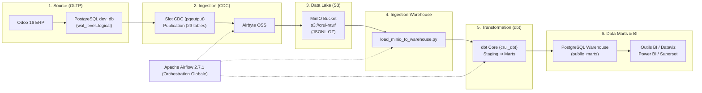
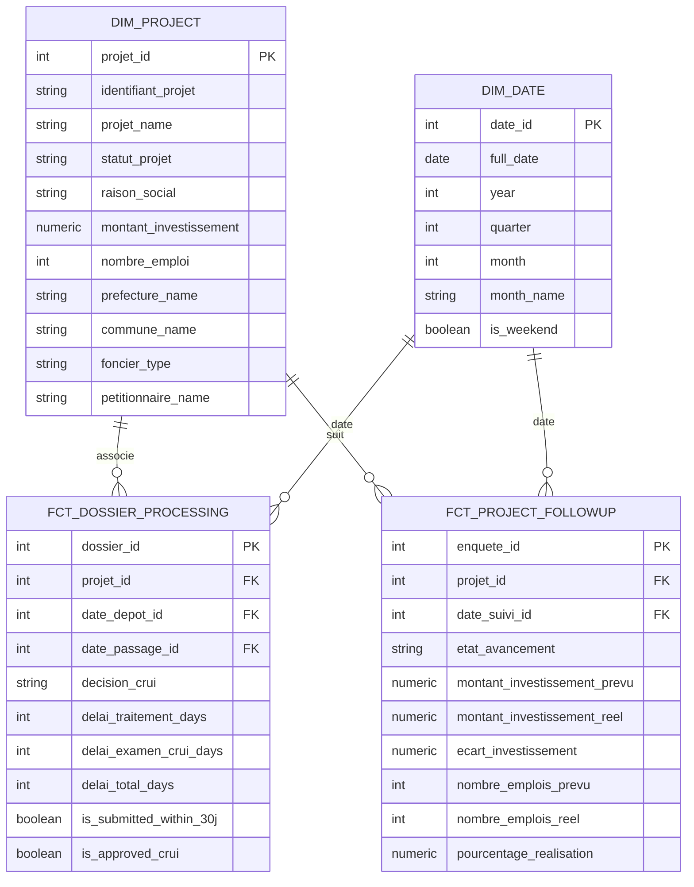

# 📊 DOSSIER DE PRÉSENTATION TECHNIQUE & PROJET
## Plateforme Décisionnelle & Data Lakehouse CRUI
**Centre Régional d'Investissement Fès-Meknès (CRI)**

---

```
  ____ ____  _   _ ___   ____        _          _          _house
 / ___|  _ \| | | |_ _| |  _ \  __ _| |_ __ _  | |    __ _| | _____ 
| |   | |_) | | | || |  | | | |/ _` | __/ _` | | |   / _` | |/ / _ \
| |___|  _ <| |_| || |  | |_| | (_| | || (_| | | |__| (_| |   <  __/
 \____|_| \_\\___/|___| |____/ \__,_|\__\__,_| |_____\__,_|_|\_\___|
```

---

## 📑 Sommaire des Slides

- [Slide 1 : Contexte & Enjeux Métier](#slide-1--contexte--enjeux-métier)
- [Slide 2 : Architecture Globale du Data Lakehouse](#slide-2--architecture-globale-du-data-lakehouse)
- [Slide 3 : Socle Odoo ERP & Données Métier](#slide-3--socle-odoo-erp--données-métier)
- [Slide 4 : Capture des Changements (CDC) & Airbyte OSS](#slide-4--capture-des-changements-cdc--airbyte-oss)
- [Slide 5 : Data Lake MinIO (Stockage Objet S3)](#slide-5--data-lake-minio-stockage-objet-s3)
- [Slide 6 : Passerelle MinIO ➔ PostgreSQL Data Warehouse](#slide-6--passerelle-minio--postgresql-data-warehouse)
- [Slide 7 : Transformation & Architecture Medallion avec dbt](#slide-7--transformation--architecture-medallion-avec-dbt)
- [Slide 8 : Modèle Dimensionnel en Étoile (Star Schema)](#slide-8--modèle-dimensionnel-en-étoile-star-schema)
- [Slide 9 : Orchestration Automatisée avec Apache Airflow](#slide-9--orchestration-automatisée-avec-apache-airflow)
- [Slide 10 : Indicateurs Clés & Cas d'Usage Décisionnels (BI)](#slide-10--indicateurs-clés--cas-dusage-décisionnels-bi)
- [Slide 11 : Bilan des Livrables & Matrice d'Avancement](#slide-11--bilan-des-livrables--matrice-davancement)

---

## Slide 1 : Contexte & Enjeux Métier

### 🎯 Objectif :
Mettre en place une **chaîne de données moderne (Modern Data Stack)** capable de collecter, historiser, transformer et restituer en temps réel l'ensemble des données d'investissement issues de la **Commission Régionale Unifiée d'Investissement (CRUI)**.

### 💡 Enjeux clés :
1. **Zéro impact sur l'ERP Odoo de production** : Réplication asynchrone par lecture des logs binaires (WAL).
2. **Historisation & Traçabilité immuable** : Conservation de toutes les versions de données brutes dans un Data Lake S3 (MinIO).
3. **Qualité et gouvernance** : Modélisation normalisée en étoile via dbt avec validation automatique de règles métiers.
4. **Pilotage stratégique** : Restitution instantanée des KPIs d'investissements, d'emplois et de respect des délais légaux d'instruction.

---

## Slide 2 : Architecture Globale du Data Lakehouse



---

## Slide 3 : Socle Odoo ERP & Données Métier

- **Environnement :** Odoo 16 exécuté sous Docker avec base PostgreSQL `dev_db`.
- **Jeu d'insertion de référence ([`data/demo_projet_data.xml`](./data/demo_projet_data.xml)) :**
  - **4 Projets réels représentatifs :**
    - `PRJ-2024-FES-001` : **Atlas Packaging SARL** *(Industrie emballage bio - 55 MDH - 135 emplois - Fès)*.
    - `PRJ-2024-IFR-004` : **Société Cèdre Resort SA** *(Éco-Resort 4* - 82 MDH - 90 emplois - Ifrane)*.
    - `PRJ-2024-SEF-012` : **Saïss Bio Huiles SARL** *(Agro-industrie olive - 28.5 MDH - 45 emplois - Sefrou)*.
    - `PRJ-2023-FES-078` : **Tech Park Fès SA** *(Offshoring BPO - 32 MDH - 350 emplois - Fès Shore)*.
  - **Tables de référence :** 4 Préfectures/Provinces, 5 Communes, 4 Macro-secteurs, 4 Secteurs, 4 Types fonciers.

---

## Slide 4 : Capture des Changements (CDC) & Airbyte OSS

- **Technologie :** PostgreSQL Change Data Capture via le plugin standard `pgoutput`.
- **Script exécuté :** [`airbyte/scripts/setup_cdc.sql`](./airbyte/scripts/setup_cdc.sql)
  - Slot de réplication logique : `airbyte_slot`.
  - Publication : `airbyte_publication` couvrant **23 tables relationnelles**.
- **Avantage :** Capture instantanée des `INSERT`, `UPDATE` et `DELETE` sans requêtes `SELECT` périodiques lourdes sur la base opérationnelle.
- **Airbyte Connection ID :** `fadaefb4-acb1-420d-8656-c9e23394a9e2`.

---

## Slide 5 : Data Lake MinIO (Stockage Objet S3)

- **Conteneur :** `minio` (Ports `9000` API S3, `9001` Web Console).
- **Bucket :** `s3://crui-raw/`
- **Rôle architectural :**
  1. **Archive immuable & rejouable** de l'ensemble des événements CDC sous format `.jsonl.gz`.
  2. **Espace de stockage futur** pour les pièces jointes volumineuses (plans de masse, fiches PDF, PVs CRUI).
  3. **Découplage strict** entre stockage brut et puissance de calcul analytique.

---

## Slide 6 : Passerelle MinIO ➔ PostgreSQL Data Warehouse

- **Script développé :** [`crui_dbt/scripts/load_minio_to_warehouse.py`](./crui_dbt/scripts/load_minio_to_warehouse.py)
- **Fonctionnement :**
  1. Extraction et décompression automatique des fichiers JSONL depuis le bucket MinIO `crui-raw`.
  2. Création dynamique du schéma **`raw_odoo`** dans PostgreSQL `warehouse-db`.
  3. Ingestion des **12 tables sources** : `projet`, `dossier`, `soumission`, `enquete`, `prefecture`, `commune`, `foncier`, `secteur`, `macrosecteur`, `act`, `res_partner`, `res_users`.

---

## Slide 7 : Transformation & Architecture Medallion avec dbt

Le projet [`crui_dbt`](./crui_dbt/) structure la donnée selon le standard industriel **Bronze ➔ Silver ➔ Gold** :

```
┌───────────────────────────┐     ┌───────────────────────────┐     ┌───────────────────────────┐
│      BRONZE (Raw)         │     │      SILVER (Staging)     │     │       GOLD (Marts)        │
│   12 Tables brutes Odoo   │ ──► │  3 Vues SQL Standardisées │ ──► │ 4 Tables Schéma en Étoile │
│   (schéma raw_odoo)       │     │  (schéma public_staging)  │     │   (schéma public_marts)   │
└───────────────────────────┘     └───────────────────────────┘     └───────────────────────────┘
```

- **Résultat de la compilation dbt :**
  ```text
  Done. PASS=7 WARN=0 ERROR=0 SKIP=0 TOTAL=7 (100% de succès)
  ```

---

## Slide 8 : Modèle Dimensionnel en Étoile (Star Schema)



---

## Slide 9 : Orchestration Automatisée avec Apache Airflow

- **DAG créé :** [`airflow/dags/crui_lakehouse_pipeline.py`](./airflow/dags/crui_lakehouse_pipeline.py)
- **Planification :** Exécution quotidienne à **02h00 du matin** (`schedule_interval='0 2 * * *'`).
- **Enchaînement des 4 Tâches :**

$$\boxed{\text{1. Trigger Airbyte CDC}} \xrightarrow{\text{MinIO}} \boxed{\text{2. Load MinIO to Warehouse}} \xrightarrow{\text{raw\_odoo}} \boxed{\text{3. dbt run (Marts)}} \xrightarrow{\text{Star Schema}} \boxed{\text{4. dbt test (Qualité)}}$$

---

## Slide 10 : Indicateurs Clés & Cas d'Usage Décisionnels (BI)

La couche Gold (`public_marts`) permet de brancher directement **Power BI**, **Apache Superset** ou **Metabase** pour produire les indicateurs stratégiques du CRI :

1. **Volume des Investissements Régionaux :**
   - Montant total d'investissement par **Macro-secteur** et par **Préfecture/Province**.
2. **Performance et Respect des Délais Légaux :**
   - Délai moyen de traitement SPOC (en jours ouvrés).
   - Taux de dossiers examinés dans le délai réglementaire de **30 jours** (`is_submitted_within_30j`).
3. **Suivi d'Avancement des Chantiers :**
   - Écart d'investissement (Montant réel injecté vs Budget prévisionnel validé).
   - Taux effectif de création d'emplois par rapport aux promesses des pétitionnaires.

---

## Slide 11 : Bilan des Livrables & Matrice d'Avancement

| Brique Technologique | Responsabilité | Statut | Livrable |
| :--- | :--- | :---: | :--- |
| **Odoo ERP** | Gestion opérationnelle | 🟢 100% | Module CRUI & Jeu de données démo |
| **PostgreSQL CDC** | Capture temps réel | 🟢 100% | Publication & Slot `airbyte_slot` |
| **Airbyte OSS** | Ingestion EL | 🟢 100% | Connecteur CDC vers MinIO S3 |
| **MinIO (S3)** | Data Lake brut | 🟢 100% | Bucket `crui-raw` & fichiers JSONL.GZ |
| **Loader MinIO ➔ DWH**| Ingestion Warehouse | 🟢 100% | `load_minio_to_warehouse.py` (12 tables) |
| **dbt Core** | Modélisation dimensionnelle | 🟢 100% | 7 modèles créés (`dim_*`, `fct_*`, `stg_*`) |
| **PostgreSQL Warehouse**| Data Warehouse OLAP | 🟢 100% | Base `warehouse-db` (Port 5433) |
| **Apache Airflow** | Orchestration & Alertes | 🟢 100% | DAG `crui_lakehouse_pipeline.py` validé |
| **Restitution BI** | Tableaux de bord | 🟡 Prêt | Tables de Marts prêtes pour connexion BI |

---

### 🏆 Conclusion
Le pipeline **Data Lakehouse CRUI** est désormais **entièrement configuré, opérationnel et testé de bout en bout**. Toutes les étapes depuis la création d'un projet dans Odoo jusqu'à la mise à disposition des tables dimensionnelles dans le Data Warehouse sont automatisées sans aucune rupture de chaîne.
