# 📋 RAPPORT DE NETTOYAGE ET QUALITÉ DE DONNÉES (DATA QUALITY)
## Plateforme Décisionnelle & ERP Odoo CRUI
**Centre Régional d'Investissement Fès-Meknès (CRI)**

---

## 📌 1. Synthèse Exécutive

Dans le cadre de l'optimisation du système d'information décisionnel de la **Commission Régionale Unifiée d'Investissement (CRUI)**, une opération majeure d'assainissement et de standardisation des tables de référence a été réalisée le **27 Août 2026**.

### 🎯 Objectifs de l'Opération :
1. **Éliminer la dette technique de données** accumulée lors d'anciens imports (textes de dossiers copiés-collés dans les listes, numéros de parcelles enregistrés comme types fonciers, fautes de frappe, URLs orphelines).
2. **Standardiser les référentiels** selon la nomenclature officielle nationale et régionale (AMDIE / Ministère de l'Investissement / CRI).
3. **Garantir l'intégrité référentielle** des **1 123 projets d'investissement** déjà enregistrés dans Odoo.
4. **Alimenter des tableaux de bord décisionnels fiables** (Data Marts dbt / Power BI / Apache Superset) sans distorsion de regroupement (évite d'avoir "Fès", "FES", "F-s", "feq" en catégories distinctes).

---

## 📊 2. Tableau de Bord Global du Nettoyage

| Table Référentiel | Lignes Avant | Lignes Après | Entrées Supprimées / Fusionnées | Taux de Réduction de Bruit | Statut Intégrité (1 123 Projets) |
| :--- | :---: | :---: | :---: | :---: | :---: |
| **`prefecture`** | 71 | **9** | **-62** (87.3%) | 🟢 Éliminé | ✅ 100% Réassigné |
| **`commune`** | 236 | **29** | **-207** (87.7%) | 🟢 Éliminé | ✅ 100% Réassigné |
| **`secteur`** | 227 | **16** | **-211** (92.9%) | 🟢 Éliminé | ✅ 100% Réassigné |
| **`macrosecteur`** | 31 | **8** | **-23** (74.2%) | 🟢 Éliminé | ✅ 100% Réassigné |
| **`foncier`** | 56 | **8** | **-48** (85.7%) | 🟢 Éliminé | ✅ 100% Réassigné |
| **`act`** | 38 | **10** | **-28** (73.7%) | 🟢 Éliminé | ✅ 100% Réassigné |
| **TOTAL** | **659** | **80** | **-579** (**87.8%**) | 🟢 **Assaini** | ✅ **Zéro perte de projet** |

```
Distribution des données :
[Avant Nettoyage]  ████████████████████████████████████████ 659 entrées
[Après Nettoyage]  ████ 80 entrées officielles (-87.8% de bruit résolu)
```

---

## 🔍 3. Analyse Détaillée par Table & Règles de Fusion

---

### 🏛️ 3.1. Préfectures et Provinces (`prefecture`)
* **Problème initial :** Variantes orthographiques multiples (`F-s`, `Fsè`, `f7S`, `feq`, `Mekns`, `Sferou`, `Sefru`, `Serou`), noms de communes enregistrés comme préfectures (`Azrou`, `Ain Chkef`), et URLs orphelines.
* **Résultat :** Conservation stricte du découpage administratif officiel des **9 Préfectures/Provinces** de la Région Fès-Meknès :

| ID | Libellé Standardisé | Catégorie | Anciennes Variantes Fusionnées |
| :---: | :--- | :--- | :--- |
| **135** | **Préfecture de Fès** | Préfecture | `FES`, `Fès`, `Fsè`, `Fèq`, `Fèqs`, `f7S`, `feq`, `F-s`, `Fès/Sefrou`, `Fès/Sidi Hrazem` |
| **136** | **Préfecture de Meknès** | Préfecture | `MEKNES`, `Meknès`, `Mekns`, `MEKNES AL KIFANE`, `MEKNES ROMMANE`, `MEKNES ZARHOUN` |
| **137** | **Province de Sefrou** | Province | `SEFROU`, `Sefrou`, `Sefroun`, `Sefru`, `Serou`, `Sferou`, `SEFROU AHMED`, `SEFROU AQORAR`, `SEFROU LAJROUF` |
| **138** | **Province d'Ifrane** | Province | `IFRANE`, `Ifrane` |
| **70** | **Province d'El Hajeb** | Province | `EL HAJEB`, `El Hajeb` |
| **71** | **Province de Moulay Yacoub** | Province | `MOULAY YACOUB`, `MOULAY YAACOUB`, `Moulay Yacoub` |
| **84** | **Province de Taounate** | Province | `TAOUNATE`, `Taounate`, `Taounatz`, `TAOUNATE ABDELKRIM` |
| **75** | **Province de Boulemane** | Province | `BOULEMANE`, `Boulemane` |
| **73** | **Province de Taza** | Province | `TAZA`, `Taza`, `TAZA GHARBIA`, `TAZA ACHARQIA` |

---

### 🏘️ 3.2. Communes Régionales (`commune`)
* **Problème initial :** Des paragraphes entiers descriptifs de dossiers (ex: *"Ait Sebaa Lajrouf X Nouveau dossier (premier passage) Typologie du projet..."*) avaient été accidentellement importés comme noms de communes.
* **Résultat :** Nettoyage des 207 entrées parasites et structuration des **29 communes clés** de la région :

| Communes Urbaines / Pôles Métropolitains | Communes Rurales & Pôles de Développement |
| :--- | :--- |
| • Fès - Agdal *(ID 1)*<br>• Fès - Médina *(ID 2)*<br>• Fès - Saïss *(ID 56)*<br>• Fès - Zouagha *(ID 149)*<br>• Meknès *(ID 50)*<br>• Sefrou *(ID 89)*<br>• Ifrane *(ID 95)*<br>• Azrou *(ID 90)*<br>• Taza *(ID 25)*<br>• El Hajeb *(ID 138)*<br>• Taounate *(ID 145)*<br>• Boulemane *(ID 108)*<br>• Missour *(ID 212)* | • Aïn Cheggag *(ID 4)*<br>• Aïn Chkef *(ID 70)*<br>• Bhalil *(ID 28)*<br>• Imouzzer Kandar *(ID 142)*<br>• Moulay Yacoub *(ID 114)*<br>• Aït Boubidmane *(ID 40)*<br>• Aït Bourzouine *(ID 75)*<br>• Aït Yaâzem *(ID 57)*<br>• Aït Sebaâ Lajrouf *(ID 235)*<br>• Guigou *(ID 141)*<br>• Bouchabel *(ID 172)*<br>• Ghiata Al Gharbia *(ID 55)*<br>• Bab Marzouka *(ID 182)*<br>• Bni Frassen *(ID 53)*<br>• Bni Lent *(ID 105)*<br>• Oulad Zbair *(ID 131)* |

---

### 🏭 3.3. Secteurs & Macro-Secteurs d'Activité (`secteur` & `macrosecteur`)
* **Problème initial :** 227 micro-secteurs fragmentés (ex: *"conditionnement"*, *"des équipements"*, *"carriere"*, *"indu"*, *"tanne"*).
* **Résultat :** Réduction à **16 Secteurs d'Activité Clairs** regroupés sous **8 Macro-Secteurs Stratégiques** :

```mermaid
graph TD
    subgraph MacroSecteurs["8 Macro-Secteurs Stratégiques"]
        M1["Agro-industrie & Agriculture"]
        M2["Industrie & Énergie"]
        M3["Tourisme, Hôtellerie & Loisirs"]
        M4["Services, IT & Offshoring"]
        M5["BTP & Immobilier"]
        M6["Commerce & Distribution"]
        M7["Logistique & Transport"]
        M8["Santé & Enseignement"]
    end

    subgraph Secteurs["16 Secteurs d'Activité"]
        S1["Agriculture, Élevage & Forêt"] --> M1
        S2["Agro-alimentaire & Transformation"] --> M1
        S3["Industrie Chimique & Parachimique"] --> M2
        S4["Industrie Automobile & Transport"] --> M2
        S5["Industrie Métallurgique & Mécanique"] --> M2
        S6["Textile, Habillement & Cuir"] --> M2
        S7["Energies Renouvelables & Environnement"] --> M2
        S8["Mines & Carrières"] --> M2
        S9["Hôtellerie, Tourisme & Restauration"] --> M3
        S10["Offshoring, IT & Télécoms"] --> M4
        S11["Artisanat & Métiers d'Art"] --> M4
        S12["BTP & Matériaux de Construction"] --> M5
        S13["Immobilier & Aménagement"] --> M5
        S14["Commerce, Distribution & Logistique"] --> M6
        S15["Santé, Médical & Pharmaceutique"] --> M8
        S16["Enseignement & Formation"] --> M8
    end
```



---

### 📜 3.4. Régimes Fonciers (`foncier`)
* **Problème initial :** De nombreux numéros de Titres Fonciers (ex: `137 585/69`, `230 674/07`) avaient été créés en tant que types de foncier au lieu d'être renseignés dans le champ `reference_fonciere`.
* **Résultat :** Référence standardisée selon le cadre juridique foncier marocain :

| ID | Régime Foncier Homologué | Définition Légale / Usage |
| :---: | :--- | :--- |
| **1** | **Melk Privé (Titre Foncier)** | Propriété privée immatriculée ou en cours |
| **2** | **Domaine Privé de l'État** | Terrains étatiques mis à disposition par convention/location |
| **3** | **Lot en Parc Industriel / ZAE** | Lots viabilisés (ex: Agropolis, Fès Shore, Ras El Ma) |
| **4** | **Terres Collectives (Soulaliyate)** | Terres sous tutelle de la Direction des Affaires Coutumières |
| **8** | **Domaine Forestier** | Terrains sous régime forestier (AOT / Délimitation) |
| **20** | **Habous** | Biens de mainmorte sous tutelle du Ministère des Habous |
| **21** | **Domaine Public / Communal** | Patrimoine des collectivités territoriales |
| **13** | **Non Immatriculé / Réquisition** | Terrains sous statut coutumier / réquisition |

---

### ⚖️ 3.5. Actes Administratifs CRUI (`act`)
* **Problème initial :** Références de dossiers et doublons d'actes d'urbanisme.
* **Résultat :** Les **10 actes légaux clés** délivrés ou instruits par le CRI et la CRUI :

1. `Accord de principe CRUI` *(ID 1)*
2. `Permis de construire` *(ID 2)*
3. `Dérogation urbanistique` *(ID 3)*
4. `Attestation de Vocation Non Agricole (AVNA)` *(ID 10)*
5. `Attribution de lot en Zone Industrielle` *(ID 4)*
6. `Autorisation de lotir` *(ID 38)*
7. `Classement d'exploitation touristique` *(ID 28)*
8. `Autorisation d'occupation temporaire (AOT)` *(ID 17)*
9. `Convention d'Investissement avec l'État` *(ID 23)*
10. `Étude d'impact sur l'environnement` *(ID 6)*

---

## 🛡️ 4. Sécurité & Intégrité des Données

1. **Aucune rupture de clé étrangère** : Toutes les liaisons Many-to-Many (`projet_secteur_rel`, `foncier_projet_rel`, `macrosecteur_projet_rel`, `act_dossier_rel`) et Many-to-One (`commune_id`, `prefecture_id`, `foncier_id`) ont été réaffectées par script SQL avant suppression des orphelins.
2. **Rejouabilité totale** : Les scripts de nettoyage sont versionnés et conservés sous :
   - [`addons/crui/scripts/clean_prefecture.sql`](./scripts/clean_prefecture.sql)
   - [`addons/crui/scripts/clean_all_crui_data.sql`](./scripts/clean_all_crui_data.sql)
3. **Mise à jour du Cache Applicatif** : Le serveur Web Odoo a été redémarré avec succès pour rafraîchir l'ORM et purger les anciens enregistrements en cache.

---

## 📈 5. Bénéfices Directs pour le Reporting & l'Analytics

| Avant le Nettoyage | Après le Nettoyage |
| :--- | :--- |
| ❌ Filtres BI pollués par plus de 200 valeurs | ✅ Filtres déroulants nets (9 provinces, 16 secteurs) |
| ❌ Risque de sous-évaluation d'une province (ex: Fès scindé en 9 labels) | ✅ 100% des investissements agrégés fidèlement |
| ❌ Saisie difficile et lente pour les chargés de projet Odoo | ✅ Interface Odoo intuitive et rapide |
| ❌ Jointures SQL ralenties par des centaines de lignes inutiles | ✅ Performance optimale des requêtes OLAP & dbt |

---

*Document validé et archivé dans le socle documentaire du projet Data Lakehouse CRUI.*
