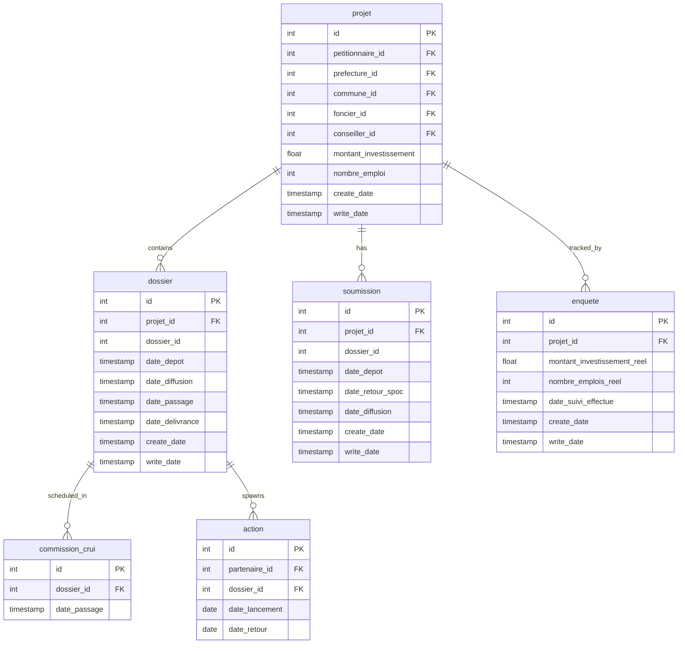
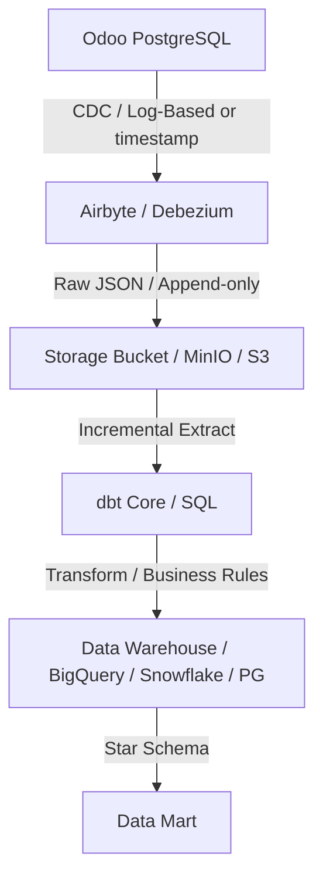
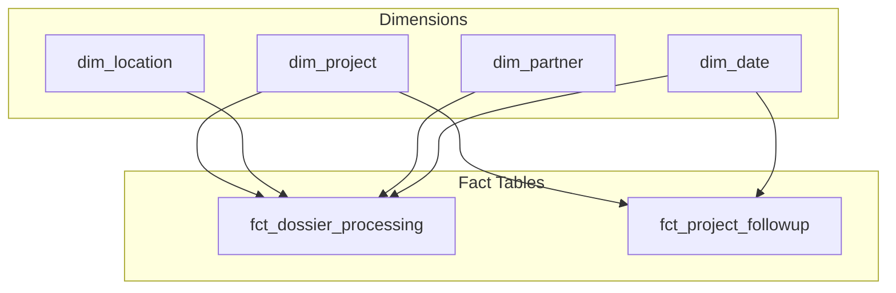

# Data Engineering Specification & Execution Plan

This document outlines the source schema mapping, data pipeline architecture, data governance checks, and Star Schema Data Mart model for the custom Odoo system.

---

## 1. Source Schema Inspection & Mapping

Odoo models map directly to PostgreSQL tables. By default, Odoo automatically adds standard columns to every table:
*   `id` (`INTEGER PRIMARY KEY` / `SERIAL`)
*   `create_uid` (`INTEGER FK` to `res_users`) - Creator user
*   `create_date` (`TIMESTAMP WITHOUT TIME ZONE`) - Creation timestamp
*   `write_uid` (`INTEGER FK` to `res_users`) - Last editor user
*   `write_date` (`TIMESTAMP WITHOUT TIME ZONE`) - Last edit timestamp (critical for Incremental Loads / CDC)

### Core Odoo Tables & PostgreSQL Mapping

| Odoo Model Name | PostgreSQL Table Name | Entity Type | Primary Key | Description |
| :--- | :--- | :--- | :--- | :--- |
| `projet` | `projet` | Operational Entity | `id` | Core Investment Project |
| `dossier` | `dossier` | Transactional | `id` | Investment file/dossier processing records |
| `soumission` | `soumission` | Transactional | `id` | Investor submissions before diffusion |
| `enquete` | `enquete` | Transactional | `id` | Project follow-up surveys for real vs. planned tracking |
| `commission.crui` | `commission_crui` | Transactional | `id` | CRUI Commission meetings |
| `action` | `action` | Transactional | `id` | Actions assigned to partners for dossiers |
| `act` | `act` | Reference / Dimension | `id` | Types of administrative acts requested |
| `commune` | `commune` | Reference / Dimension | `id` | Communes reference table |
| `prefecture` | `prefecture` | Reference / Dimension | `id` | Prefectures/Provinces reference table |
| `secteur` | `secteur` | Reference / Dimension | `id` | Secteurs of activity (defined in [macrosecteur.py](file:///c:/Users/AYMANE/Desktop/odoo-docker/addons/crui/models/macrosecteur.py)) |
| `macrosecteur` | `macrosecteur` | Reference / Dimension | `id` | Macro-secteurs of activity (defined in [secteur.py](file:///c:/Users/AYMANE/Desktop/odoo-docker/addons/crui/models/secteur.py)) |
| `foncier` | `foncier` | Reference / Dimension | `id` | Land/Property status reference table |
| `conseiller` | `conseiller` | Reference / Dimension | `id` | SPOC Conseiller mapping |
| `visite` | `visite` | Transactional | `id` | Investor visit logs |
| `res.partner` | `res_partner` | Core System | `id` | Investors, partners, and commission members |
| `res.users` | `res_users` | Core System | `id` | System users (Conseillers/SPOCs) |

---

### Key Relationships & Foreign Keys



### Many-to-Many Join Tables
Odoo generates intermediate join tables for `Many2many` relationships:
1.  **`projet_secteur_rel`**: Connects `projet` (`projet_id`) and `secteur` (`secteur_id`).
2.  **`projet_foncier_rel`**: Connects `projet` (`projet_id`) and `foncier` (`foncier_id`).
3.  **`projet_macrosecteur_rel`**: Connects `projet` (`projet_id`) and `macrosecteur` (`macrosecteur_id`).
4.  **`dossier_act_rel`**: Connects `dossier` (`dossier_id`) and `act` (`act_id`).
5.  **`dossier_action_rel`**: Connects `dossier` (`dossier_id`) and `action` (`action_id`).
6.  **`soumission_act_rel`**: Connects `soumission` (`soumission_id`) and `act` (`act_id`).
7.  **`commission_crui_res_partner_rel`**: Connects `commission_crui` and `res_partner` for commission members.

---

## 2. Robust CDC & Incremental ETL Pipeline Architecture

To pull data from PostgreSQL without overloading the transaction database, an incremental Change Data Capture (CDC) strategy is proposed.

### Pipeline Flow Diagram


### CDC Strategy Details
1.  **CDC Method**: Log-Based CDC (PostgreSQL WAL using Logical Replication with `pgoutput` plugin via Debezium/Airbyte) is highly recommended. It captures `INSERT`, `UPDATE`, and `DELETE` operations in near real-time without querying database tables or impacting production read performances.
2.  **Incremental Fallback**: If Logical Replication is restricted, a query-based incremental load using `write_date` columns will filter records where:
    ```sql
    SELECT * FROM {table} WHERE write_date > :last_extracted_timestamp
    ```
3.  **Handling Deletes**: Standard Odoo hard-deletes (`unlink` method) will be captured via logical replication as `DELETE` operations and marked with `is_deleted = TRUE` in the OWH Raw layer (soft-delete strategy in Data Lake).

---

## 3. Data Governance & Data Quality (DQ) Rules

Establishing DQ validation checks at the ingest and transform levels ensures report reliability.

### Key Validation Checks
1.  **Timeline Coherence (Chronological Dates)**:
    *   `date_depot` $\le$ `date_retour_spoc` $\le$ `date_diffusion` $\le$ `date_passage` $\le$ `date_delivrance`
    *   **Action**: Flag and quarantine anomalies (e.g., negative duration fields like `delai_moyen_traitement`).
2.  **Referential Integrity**:
    *   Orphaned dossiers or actions pointing to non-existent project IDs.
3.  **Value Range Checks**:
    *   `montant_investissement` $\ge 0$
    *   `nombre_emploi` $\ge 0$
    *   `pourcentage_realisation` between $0$ and $100$.

### dbt Test Implementation Example
```yaml
version: 2

models:
  - name: stg_dossier
    columns:
      - name: id
        tests:
          - unique
          - not_null
      - name: date_depot
        tests:
          - not_null
  - name: fct_dossier_processing
    tests:
      - expression_is_true:
          expression: "date_diffusion >= date_depot"
      - expression_is_true:
          expression: "date_passage >= date_diffusion"
```

---

## 4. Data Mart Architecture (Star Schema)

A clean dimensional model optimized for analytical queries (OLAP).



### Fact Tables
1.  **`fct_dossier_processing`**: Granularity: One row per dossier event/process cycle.
    *   *Keys*: `dossier_id`, `project_key`, `date_depot_key`, `date_diffusion_key`, `date_passage_key`, `date_delivrance_key`, `partner_key`, `location_key`.
    *   *Measures*: `delai_traitement_days` (working days), `delai_examen_crui_days`, `delai_delivrance_act_days`, `delai_total_traitement_days`, `is_submitted_within_30j`, `is_examined_within_30j`.
2.  **`fct_project_followup`**: Granularity: One row per survey entry (`enquete`).
    *   *Keys*: `enquete_id`, `project_key`, `date_suivi_key`.
    *   *Measures*: `montant_investissement_reel`, `nombre_emplois_reel`, `pourcentage_realisation`.

### Dimension Tables
1.  **`dim_project`**: Contains slow-moving attribute fields (`project_id`, `name`, `reference_fonciere`, `raison_social`, `forme_juridique`, `surface`, `planned_investment`, `planned_jobs`, `statut`).
2.  **`dim_location`**: Consolidated hierarchy of prefectures and communes (`location_key`, `commune_name`, `prefecture_name`).
3.  **`dim_partner`**: Details of petitionnaires, partners, or SPOC users (`partner_key`, `partner_name`, `partner_type`, `spoc_email`).
4.  **`dim_date`**: Calendar helper table (`date_key`, `day_date`, `year`, `quarter`, `month`, `is_working_day`).
